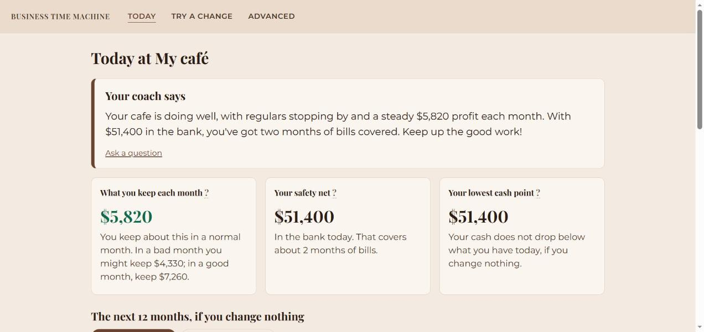
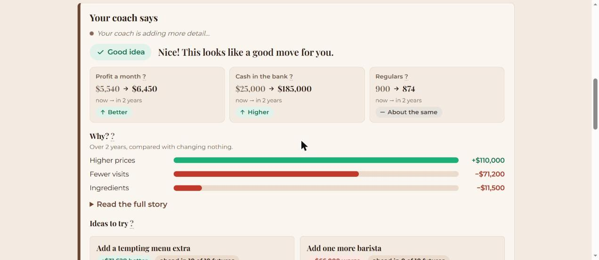
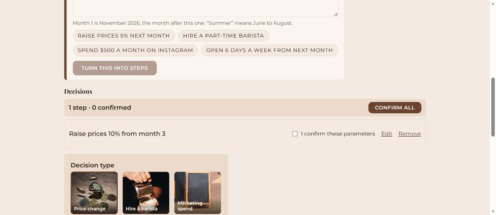
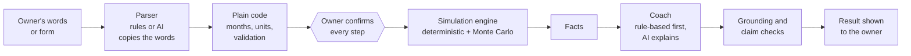

<div align="center">

# Business Time Machine

### See your next year before you decide anything.

An AI-assisted decision simulator for small cafés, restaurants and bakeries.<br>
Describe a change, check the plan, and watch what could happen to your profit, cash and customers.


</div>

---

## What it is

Most small food businesses make big choices on instinct: raise prices, hire a baker, run a promotion, change opening hours. Spreadsheets are slow to build and easy to get wrong, and generic AI chat will happily give you confident numbers it made up.

**Business Time Machine** lets an owner try a decision on paper first. It projects the business month by month for 12 to 36 months, compares it with "if you change nothing", and explains the result in plain words.

> **The golden rule: the AI never calculates a number.**
> A deterministic simulation engine does all the maths. The AI only turns the owner's words into decisions and explains results using facts the engine produced. Every number in AI text is checked against those facts, and anything that does not match is thrown away.

## Features

| | |
|---|---|
| **A simple start** | Pick a business type and answer four questions (customers on a normal day, average spend, rent, people who work there), or try a one-click sample café, restaurant or bakery. Everything else is filled in with typical numbers, and a "What we assumed" note shows each guess so you can change it. |
| **The coach speaks first** | The Today page opens with 2 to 4 friendly sentences about your business as it is, three tiles (what you keep each month, your safety net, your lowest cash point) and a 12-month chart. A short 3-step tour appears the first time. |
| **Try a change** | Move a price slider and see, as you drag, what you would keep each month, the catch (fewer visits) and ten dots for "ahead in N of 10 futures". It is labelled "just a sketch" and nothing is saved. "Watch the next 12 months" opens a month-by-month view with a good-case/bad-case band, and "Save this as a scenario" runs the full simulation with your coach. |
| **Always a way back** | Every page except the start screen has a "← Back" button under the top bar. It returns to the page you were just on, or to the page one level up if you opened a link directly. The browser's own Back button keeps working. |
| **Switch, delete, undo** | A business menu in the header lets you switch between your businesses, start a new one or try a sample. You can delete a scenario, a run or a whole business; the box says what else goes with it, and an Undo message stays for 8 seconds. Nothing is erased for good (it is hidden), and the AI logs are always kept. |
| **Say it in your own words** | Type "raise prices 10% in March and hire a baker for the summer". The app turns it into editable steps with your own words shown beside each one, and asks a question when something is missing. |
| **You stay in control** | Nothing is simulated until you have confirmed every step (one by one, or with "Confirm all"). |
| **Honest about uncertainty** | Monte Carlo runs show a range (bad case, most likely, good case), not one magic number, plus "ahead in N of 10 futures". |
| **A coach that explains** | A verdict, three now-vs-later tiles, a "Why?" breakdown that adds up exactly, one watch-out only when the risk is real, and ideas to try. |
| **Instant first, smarter later** | A rule-based explanation appears right away. A local or cloud AI can then improve it in the background and swap in the better version. |
| **Three industries** | Café, restaurant and bakery templates (the bakery includes waste). Currency is set per business. |
| **Plain language everywhere** | No jargon: "if you change nothing", "bad case / most likely / good case", "in 3 of 10 futures", and a "?" tip next to every input and chart. |



*The Today page. The coach opens with a few plain sentences, then three tiles show what you keep each month, your safety net and your lowest cash point.*



*The Compare page. The coach shows a verdict, profit, cash and regulars now versus in two years, and why the profit changes.*



*The scenario builder. Every step must be confirmed before anything can be simulated.*

## How it works



Three safeguards sit between the AI and the owner:

1. **Grounding check.** Every number in AI text must exist in the engine's facts (6% tolerance). If not, one retry, then the rule-based text is used.
2. **Claim consistency check.** The AI's risk statements ("your cash could run out") must agree with the engine's risk flags, in both directions. A mismatch means the rule-based text stays.
3. **Human in the loop.** Parameters are always shown in plain sentences and confirmed by the owner. The backend refuses to simulate unconfirmed decisions.

Every run stores its engine version, random seed and number of iterations, so results can be reproduced.

## The simulation engine

A pure Python and NumPy package with no web or database dependencies, so it can be tested and cited on its own (see `engine/README.md`).

- Monthly model of customers, visits, spend, costs, staff, marketing and cash
- Steady-state calibration, so "change nothing" matches the business as entered
- Latin hypercube sampling with common random numbers, so comparing scenarios is fair
- A profit breakdown into seven drivers (price, menu, visits, ingredient costs, staff costs, marketing and fixed costs, investment and loan) that sums exactly
- Sensitivity analysis and risk flags (cash running out, losing money)

## Tech stack

| Layer | Technology |
|---|---|
| Engine | Python, NumPy |
| Backend | FastAPI, SQLAlchemy, Alembic, SQLite |
| Frontend | React, TypeScript, Vite, Recharts, React Router |
| Coach (default) | Rule-based templates, always available |
| Coach (optional AI) | Ollama (local, default model `qwen2.5:7b`) or the Anthropic API |
| Tests | pytest, Vitest, Testing Library |

## Getting started

You need Python 3.10+, Node.js 20.19+ (or 22.12+) and Git. These steps are for Windows and PowerShell.

One-time setup:

```powershell
git clone https://github.com/mafoudmaryam/business-time-machine.git
cd business-time-machine

# backend (its requirements install the engine in editable mode)
cd backend
python -m venv .venv
.venv\Scripts\Activate.ps1
pip install -r requirements.txt
alembic upgrade head          # creates backend/btm.db
python seed_demo.py           # optional: adds a "Demo Cafe" with 3 confirmed scenarios

# frontend
cd ..\frontend
npm install
cd ..
```

Then, from the repo root:

```powershell
.\start.ps1      # opens the backend (port 8000) and frontend (port 5173) in two windows
.\stop.ps1       # stops both
```

Open <http://localhost:5173>.

**Defaults are US-based.** The setup wizard's pre-filled example numbers are typical small-US-business benchmarks. The wizard tells the owner to replace them with their own; only the currency and number formatting adapt automatically.

### Optional: turn on the AI coach

The app works fully without AI (the default is `COACH_PROVIDER=template`). To add it, copy `backend/.env.example` to `backend/.env` (this file is gitignored, never commit it) and edit:

```ini
# Local and free (needs Ollama installed and the model pulled)
COACH_PROVIDER=ollama
# OLLAMA_MODEL=qwen2.5:7b

# or the Anthropic API
# COACH_PROVIDER=anthropic
# ANTHROPIC_API_KEY=your-key-here
```

`COACH_ENABLED=false` switches the coach off completely. See `backend/.env.example` for every setting.

## Running the tests

```powershell
cd backend;  .\.venv\Scripts\python.exe -m pytest      # 546 tests
cd engine;   .\.venv\Scripts\python.exe -m pytest      # 243 tests
cd frontend; npm test                                  # 480 tests
```

There is also an evaluation set of 48 hand-written sentences for the plain-language parser:

```powershell
cd backend
.\.venv\Scripts\python.exe scripts\eval_interpret.py --provider template
```

Use `--provider ollama` or `--provider anthropic` (with `--model`, `--sample N` or `--limit N`) to try an AI parser. Results are saved as CSV in `backend/eval_results/`.

## Project layout

```
engine/      Simulation engine (pure Python and NumPy)
backend/     FastAPI app, database, coach, plain-language parser, tests, eval scripts
frontend/    React and TypeScript app
docs/        Beginner journey plan, the older redesign plan, and README images
start.ps1    Starts both dev servers
stop.ps1     Stops both dev servers
CLAUDE.md    Project rules and current state
```

## Research context

This is a master's thesis project. The question it investigates:

> Does AI-assisted simulation help non-expert owners compare the consequences of decisions before committing?

The coach can be switched off (`COACH_ENABLED=false`) for a no-coach comparison group. Every AI call, retry, fallback and fix-up the owner makes to a parsed step is logged in the database, so behaviour can be analysed afterwards.

## Honest limitations

- The model is a simplification. The marketing and word-of-mouth parameters are not calibrated against real data and look too optimistic; they are reused unchanged for all three industries.
- The restaurant and bakery defaults are typical-small-business estimates, not yet calibrated.
- Numbers are scenarios, not forecasts, and this is not financial advice.
- The rule-based parser gets 44 of 48 test sentences exactly right (92%), but it was written alongside those sentences, so that figure is optimistic. An independent test set is still needed.
- A grounded AI text can still misread a true number, and the claim check reads phrases, not meaning. The instant rule-based explanation is the reliable one.
- A local AI model is slow on an ordinary laptop CPU (roughly 50 to 80 seconds per coach note on the author's laptop), which is why the rule-based version is always shown first.

## Roadmap

- [x] Multi-industry engine (café, restaurant, bakery)
- [x] Non-blocking AI coach with grounding and claim checks
- [x] Plain-language decision input
- [x] Scenario picker and "Confirm all"
- [x] Beginner journey, phase 1: four-question start, sample business, Today page with the coach speaking first, tour, simpler navigation
- [x] Beginner journey, phase 2: "Try a change" with a live price slider (just a sketch) and a 12-month timeline
- [ ] Beginner journey, phase 3: "How did we work this out?" and a printable plan
- [ ] Beginner journey, phase 4: a journal that compares predictions with real months (pilot feature)
- [ ] The rest of the visual redesign (see `docs/redesign-plan.md`)
- [ ] Streaming explanations
- [ ] PostgreSQL, user accounts and Docker, as sketched in `CLAUDE.md`

## Credits

Industry photographs are from Pexels, credited in `frontend/public/images/CREDITS.md`.

## License

Not yet chosen. Until a license is added, all rights are reserved by the author.

<div align="center">

Built with care for people who feed their neighbourhood.

</div>
