<div align="center">

# Business Time Machine

### Try a decision on paper before you make it.

An AI-assisted decision simulator for small food-service businesses: cafés, restaurants and bakeries.

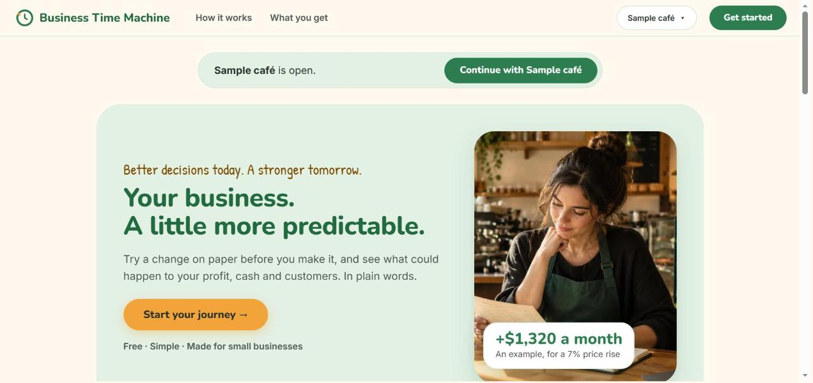

</div>

> **Status:** a personal project, still in development. The repository is private, so these steps are for the owner and collaborators. The photo above is an AI-generated image (see [Credits](#credits)).

---

## What it does

Most small food businesses make big choices on instinct: raise prices, hire a baker, run a promotion, change opening hours. Business Time Machine lets an owner try a choice first, in plain words, and see what could happen.

1. **Try a change on paper.** Move a slider or type "raise prices 10% in March". Nothing is saved until you say so.
2. **See good, likely and bad cases for the next 12 months.** Profit, cash and customers, with a range instead of one magic number, compared with "if you change nothing".
3. **Get a coach that explains in plain words.** It says what happens, why, and what to watch out for. It starts with a short rule-based text and can add a fuller one from an AI.
4. **Keep a journal.** Write down what really happened each month and see how close the forecast was.
5. **No business yet? Start with a rough plan.** "I don't have a business yet" asks nine short questions and gives a rough start-up plan (see the next section).

## The start-up guide ("I don't have a business yet")

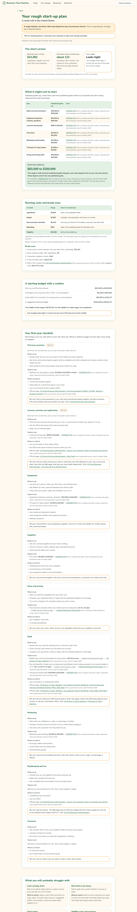

For someone who is only thinking about opening a café, restaurant or bakery. It asks nine questions, one per screen (what to open, country, budget, premises, size, menu, people, customers and spend, timeline) and then shows a **rough plan** on its own page: what it might cost to start (line by line, never one headline number), running costs a month, how many customers a day you need to break even, a starting budget with a cushion, a nine-item first-year checklist with "where to find it" pointers, and what you will probably struggle with. A button sets up a practice business from the answers so you can try changes in the simulator. Plans are saved on your computer only, can be edited, and can be deleted with Undo.

How it stays honest:
- **Every number has a source.** The numbers live in one data file (`engine/btm_engine/data/startup_ranges.json`), each with a source name, link and the date it was read; a test refuses a number without them. Our own rules (for example the contingency of 10% to 20%) are marked as **assumptions** with a reason, and shown on the plan page under "How we worked it out" next to every fact used. No AI writes anything on the plan page.
- **Wide on purpose.** Published guides disagree, so start-up cost is shown as labelled lines with their source and then a wide total range, explained in words. Vendor-written cost guides are shown as "published guides say" and named as coming from a company that sells to shops and restaurants.
- **Banner:** "This is a starting picture. It assumes your business is open and running smoothly." Everything says "A rough estimate, not advice."
- **Countries:** the **United States** has the full plan (sourced pay and cost figures). The **United Kingdom** and **China (mainland)** are "bring your own numbers": we show the official pay figures and the official licensing pointer, but you type your own rent and ingredient share, and there is no start-up cost total. **Anywhere else** gets the checklist only, with no cost numbers. A US restaurant has no start-up total either, because no source could be read.
- **Where we cannot help we say so**, with a link to the official page. No named suppliers and no affiliate links. We are not affiliated with the sites we link to.

The practice business starts at the plan's own break-even customers a day (with its cushion) when you hoped for more, so it begins as a careful picture rather than an unrealistically profitable one; the plan page and "What we assumed" say so. Limits: only some countries, start-up cost lines for a US café and a US bakery only, and a rough model that assumes you are already trading. A link checker (`engine/scripts/check_links.py`, run by hand, not part of the tests) last ran on 2026-10-10: 13 of 16 links worked and 3 (fda.gov, gov.cn, stats.gov.cn) could not be verified from the author's machine because of a certificate error there. They are kept, marked as not verified, and each page says "Links may change; last checked <date>."

## The golden rule

> **The AI never calculates a number.**
> A deterministic simulation engine, with Monte Carlo (many random "what if" runs) on top, does all the maths. The AI only does two jobs: it turns the owner's words into choices that the owner then confirms, and it explains facts that the engine produced. Every number in the AI's text is checked against those facts, and text that does not match is thrown away.

## A quick tour

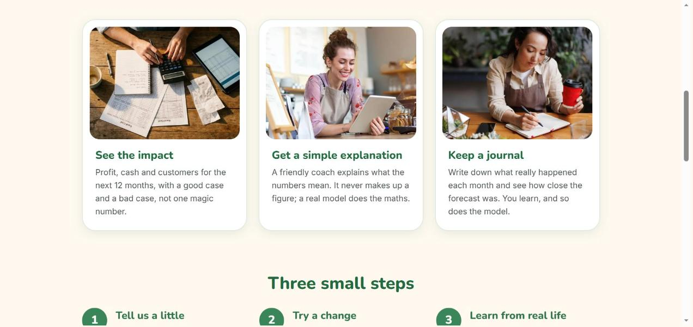

*The start page. Pick a business type, answer four questions, or try a one-click sample café, restaurant or bakery.*

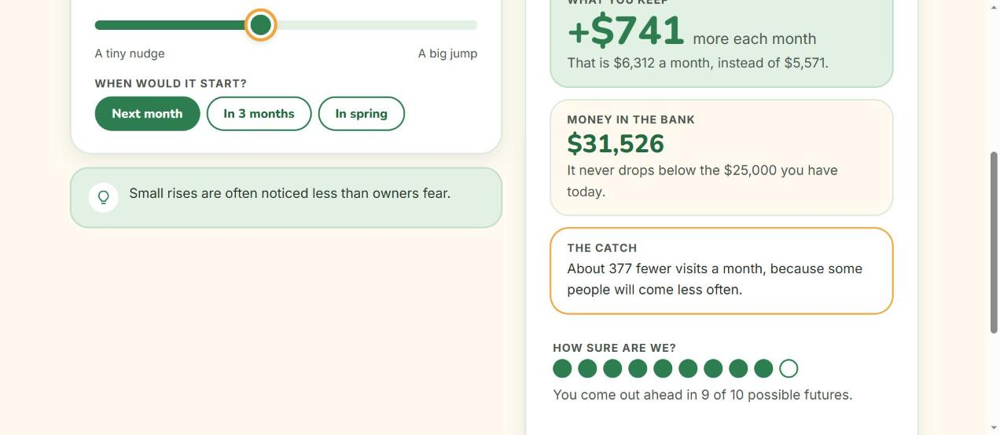

*Try a change. Drag the slider and the answer on the right moves. It is labelled "just a sketch" and nothing is saved.*

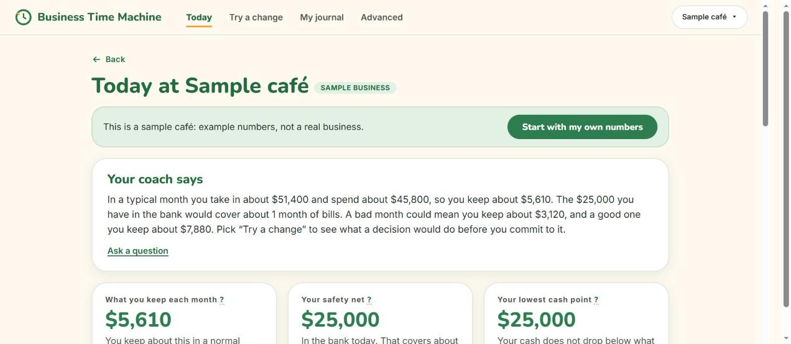

*Today. The coach opens with a few plain sentences, then three tiles: what you keep each month, your safety net and your lowest cash point.*

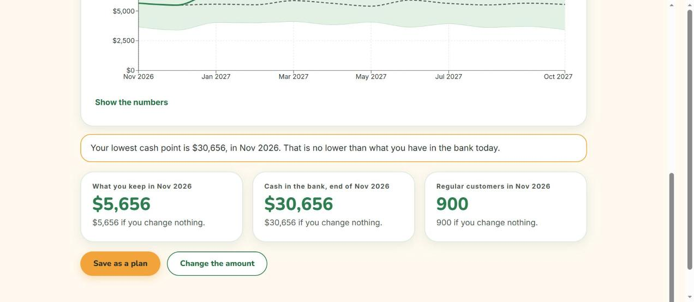

*The next 12 months, month by month, with "Save as a plan".*

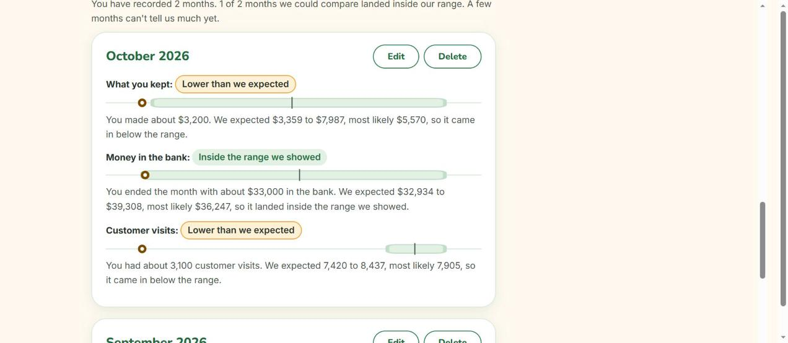

*My journal (a pilot feature). What really happened, set next to what we expected.*

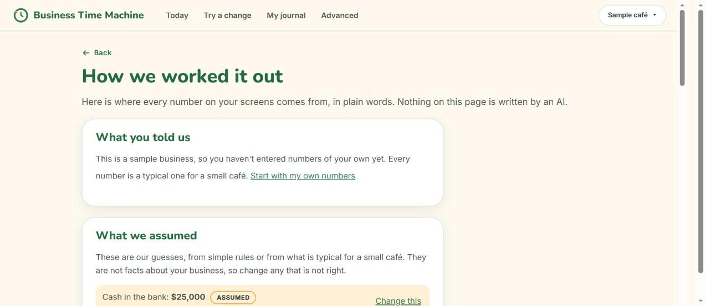

*How we worked it out. What you told us, what we guessed, and what we do not know, in plain words.*

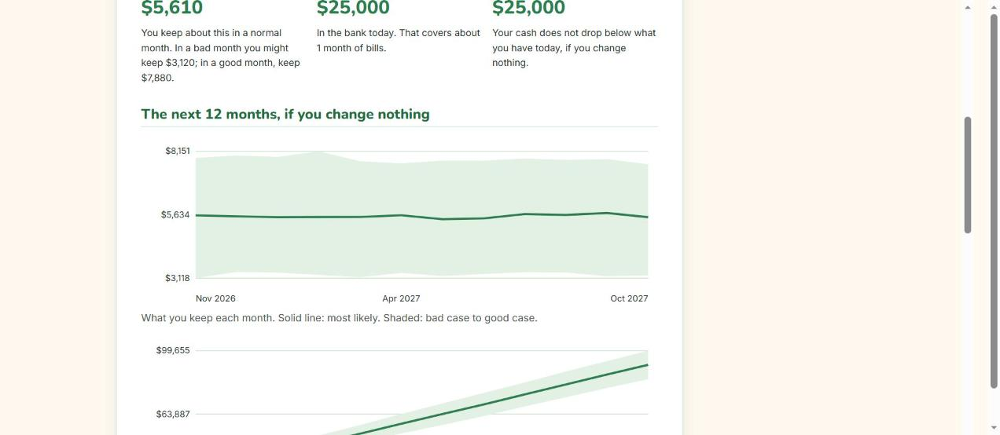

*Share. A one-page summary you can print or save as a PDF from your browser. On paper it is plain black on white.*

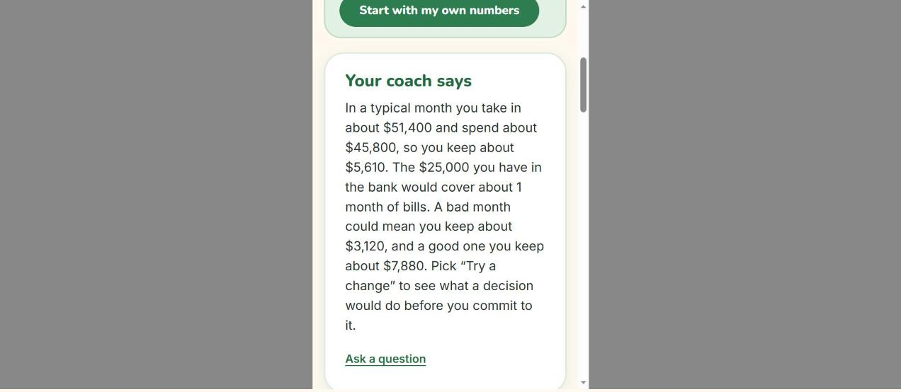

*Every page fits a phone-sized screen (390 pixels wide).*

The older, more detailed pages (scenario builder, comparison dashboard, run history and the full business setup) are still there under **Advanced** in the top bar, for example [the scenario builder](docs/images/redesign-step2/scenario-builder-1440.jpg) and [a saved result with the coach's verdict](docs/images/redesign-step2/run-history-1440-coach-card.jpg).

## Run it on your computer

These steps are for **Windows and PowerShell**.

**You need:**
- Python 3.10 or newer
- Node.js 20.19+ (or 22.12+)
- Git
- Optional: [Ollama](https://ollama.com), only if you want the local AI coach

**One-time setup** (the repository is private, so you must be signed in to GitHub as the owner or a collaborator):

```powershell
git clone https://github.com/mafoudmaryam/business-time-machine.git
cd business-time-machine

# backend (its requirements also install the engine in editable mode)
cd backend
python -m venv .venv
.venv\Scripts\Activate.ps1
pip install -r requirements.txt
alembic upgrade head          # creates backend\btm.db
python seed_demo.py           # optional: adds a "Demo Cafe" with 3 scenarios

# frontend
cd ..\frontend
npm install
cd ..
```

**Start and stop.** Run these from the **project root folder** (the one that contains `start.ps1`):

```powershell
.\start.ps1      # opens the backend (port 8000) and the frontend (port 5173) in two windows
.\stop.ps1       # stops both
```

`start.ps1` stops anything that is already listening on port 8000 first. Then open <http://localhost:5173>.

**Try a sample.** On the start page, click "Try a sample café" (or restaurant, or bakery) under a photo card. You land on the Today page with made-up example numbers. Or pick a business type and answer the four questions about your own business.

**Playing around without touching your real data.** `.\start.ps1 -TempDb` uses a brand-new throwaway database in your temp folder, so `backend\btm.db` is not used. Use it for any experiment.

### The coach: three modes

| Mode | What it is | How to switch it on |
|---|---|---|
| **Rule-based** (default) | Plain sentences written from the engine's facts. Free, instant, always available. It is also the fallback if the AI fails. | Nothing to do. |
| **Ollama** | A model running on your own computer. Free, but slow on a laptop without a graphics card (about 50 to 80 seconds on the author's laptop). | `COACH_PROVIDER=ollama` in `backend\.env` |
| **Anthropic (cloud)** | Claude through the official SDK. Needs an API key. | `COACH_PROVIDER=anthropic` and `ANTHROPIC_API_KEY=...` in `backend\.env` |

The coach never makes you wait: the rule-based text appears at once and the AI text replaces it later if it arrives and passes the checks. `COACH_ENABLED=false` switches the coach off completely.

**API keys go only in `backend\.env`.** Copy `backend\.env.example` to `backend\.env` and edit it. `backend\.env` is ignored by Git, so it is never committed. Never put a key in any file that is tracked by Git, and never paste one into an issue or a chat.

### Run the tests

```powershell
# from the project root; all three use the backend's virtual environment
cd engine;      ..\backend\.venv\Scripts\python.exe -m pytest   # 356 tests
cd ..\backend;  .\.venv\Scripts\python.exe -m pytest            # 679 tests
cd ..\frontend; npm test                                        # 781 tests
```

There is also an evaluation set of 48 hand-written sentences for the plain-language parser: `cd backend; .\.venv\Scripts\python.exe scripts\eval_interpret.py --provider template` (from the project root). Results are saved as CSV in `backend\eval_results\`.

## How it works

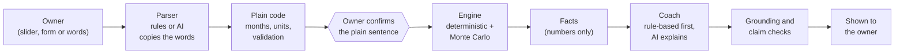

| Part | What it is |
|---|---|
| **Engine** (`engine/`) | A pure Python and NumPy package with no web or database code, so it can be tested and cited on its own. Monthly model of customers, visits, spend, costs, staff, marketing and cash, with Latin hypercube sampling and common random numbers (a fair, repeatable way to draw the random runs) so scenarios are compared fairly. See `engine/README.md`. |
| **Backend** (`backend/`) | FastAPI, SQLAlchemy and Alembic over SQLite (a small database stored in one file). `app/engine_bridge.py` is the only place that imports the engine. It also holds the coach, the plain-language parser and the journal. |
| **Frontend** (`frontend/`) | React, TypeScript, Vite and Recharts. A single typed API client (`src/api.ts`). |

**Three safeguards between the AI and the owner:**

1. **Grounding check.** Every number in AI text must exist in the engine's facts (6% rounding tolerance). If not, one retry, then the rule-based text is used.
2. **Claim consistency check.** The AI's risk statements ("your cash could run out") must agree with the engine's risk facts, in both directions. A mismatch means the rule-based text stays.
3. **Human in the loop.** Anything the AI read from the owner's words is shown as a plain sentence and must be confirmed. The backend refuses to simulate unconfirmed decisions. The one exception is the slider "sketch", which is the owner's own input, is labelled "just a sketch", is never saved and is never explained by the AI.

Every full run stores its engine version, random seed and number of iterations, so a result can be reproduced.

## Design

- **One place for the look.** `frontend/src/theme.css` holds every colour, font, shape and spacing value: cream pages, green buttons and numbers, soft sage panels, one amber highlight, charcoal text. Fonts are Nunito (headings), Inter (text) and Patrick Hand (one slogan), all served from the app itself, so it looks the same offline.
- **`frontend/src/redesign.css`** is loaded last and organised page by page; its table of contents is at the top. One colour system is shared by every chart (`src/chartTheme.ts`), and chart lines also differ by dash pattern, so colour is never the only clue.
- **Accessible by rule.** Colour pairs are checked against WCAG AA (a standard for readable colours) by a test (`src/lib/contrast.test.ts`), tap targets are at least 44 pixels, nothing scrolls sideways at 390 pixels, motion switches off for people who ask their device for less motion, and every page gets an automatic accessibility check (`vitest-axe`).
- **Printing stays plain.** The Share page prints as black on white with no decoration, and a test makes sure that rule stays last in the stylesheet.
- **A "← Back" button on every page** except the start page. It returns to the page you were on, or one level up if you opened a link directly.
- **Confetti** appears only after you save something (a plan or a journal month), never for a forecast or a good number.

## Quality

Measured on 2026-10-10, running the suites one after another on a quiet machine:

| Check | Result |
|---|---|
| Engine tests (pytest) | 356 passed |
| Backend tests (pytest) | 679 (678 passed in the last full run; the one failure was fixed and its file re-run: 70 passed. The full run was not repeated after that fix) |
| Frontend tests (Vitest, 55 files) | 781 passed |
| TypeScript check | clean |
| Lint (oxlint) | no errors, 2 old warnings |
| Production build (Vite) | succeeds |

## Honest limits

- **It is a simplified model.** The answers are scenarios, not forecasts, and this is not financial advice.
- **Some settings are guesses.** The marketing and word-of-mouth settings are not calibrated against real data and look too optimistic; they are reused for all three industries. Restaurant and bakery defaults are typical-small-business estimates. The four-question start fills in the rest with rough rules (for example "other bills are a third of the rent"); the app shows every guess and lets you change it.
- **The example numbers are US-based.** Currency and number formatting adapt, but the typical amounts are US dollars. There are no seasons in the model yet.
- **The coach can be wrong.** The checks catch numbers that are not in the facts and risk claims that contradict them, but they read phrases, not meaning. The instant rule-based text is the reliable one.
- **The cloud AI provider is not covered by automated tests with a real key.** The tests replace every provider with a stand-in, so the Anthropic mode has not been verified against the live service by this test suite.
- **The plain-language parser's score is optimistic.** The rule-based one gets 44 of 48 test sentences exactly right, but it was written alongside those sentences. A fresh, independent test set is still needed.
- **The journal is a pilot.** A few months of figures cannot prove a forecast right or wrong.
- **Pictures.** The photo in the hero is an AI-generated image. The other start-page photos' sources and licences are **not yet confirmed**; see `frontend/public/images/CREDITS.md`.

## Why I built this

This is a personal project. Small food-business owners make big choices (prices, hiring, opening hours) on instinct, and spreadsheets are slow to build and easy to get wrong. I wanted a simulator that lets an owner try a decision on paper first, see a good, likely and bad case, and have it explained in plain words, without ever letting an AI make up a number.

**A possible small test.** One day I may ask a few real owners to try the app, some with the coach and some without, and then tell me how confident they felt (a 1 to 7 score) and how easy it was to use (the System Usability Scale, a standard 10-question form). That would only happen with their consent and with as little personal data as possible. The idea is written down in `docs/study-mode-plan.md`. **None of it is built, and no test has been run: no owners have been asked and no data has been collected.**

What does exist for this: the coach can be switched off (`COACH_ENABLED=false`), and every AI call, retry and fallback, plus how each parsed step was confirmed or edited, is logged in the local database.

## Roadmap

**Done**
- [x] Simulation engine for café, restaurant and bakery
- [x] Coach with grounding and claim checks, rule-based first and non-blocking
- [x] Plain-language decision input ("describe it in your own words")
- [x] Simple four-question start, sample businesses, Today page
- [x] Business switcher, delete with undo, "← Back" on every page
- [x] Try a change and the 12-month view
- [x] How we worked it out, a print or PDF summary, friendly empty and error states
- [x] My journal (pilot)
- [x] The new look on every page
- [x] Start-up guide for people with no business yet (US full; UK and China bring your own numbers; elsewhere checklist only)

**Next**
- [ ] Study mode and a possible small test with real owners (only a possible idea for now; the open questions are in `docs/study-mode-plan.md`, and it needs the owners' consent)
- [ ] A fresh, held-out test set for the plain-language parser
- [ ] More countries for the start-up guide, once a source can be read for each
- [ ] A more realistic model (calibrating marketing and word of mouth, seasons)
- [ ] Online deployment, user accounts and PostgreSQL (sketched in `CLAUDE.md`, not started)
- [ ] Streaming explanations

See [CHANGELOG.md](CHANGELOG.md) for what changed and when.

## Privacy and data

- **Stored on your computer.** In the default setup everything lives in a local SQLite file, `backend/btm.db`. Nothing is sent anywhere, and the app loads no outside fonts or scripts. If you switch on the **cloud AI coach**, the engine's facts and any text you type into the "say it in your own words" or "Ask the coach" boxes are sent to that provider; the local Ollama mode keeps everything on your machine.
- **Your real database is protected.** Test and demo data never goes in `backend/btm.db`: use `.\start.ps1 -TempDb`, and automated tests use their own temporary databases. Databases and database backups are ignored by Git, so they cannot be committed by accident.
- **Delete is reversible.** Deleting a scenario, a result, a journal month or a business only hides it, and an Undo message stays for 8 seconds. Nothing is erased for good by itself. To erase old deleted items on purpose: `cd backend; .\.venv\Scripts\python.exe scripts\purge_deleted.py` shows what would go; add `--older-than-days 30 --yes` to really delete. The AI logs are kept even then, as logged data.
- **The journal's CSV download** is made in your browser from what is on screen.
- **No accounts and no tracking of who you are.** The app records anonymous usage events (which screen, which button) in your own database, with no free text.

## Project layout

```
engine/      Simulation engine (pure Python and NumPy)
backend/     FastAPI app, database, coach, plain-language parser, tests, scripts
frontend/    React and TypeScript app
docs/        Plans (beginner journey, study mode), screenshots
start.ps1    Starts both dev servers (from the project root)
stop.ps1     Stops both dev servers
CLAUDE.md    Project rules and the current state, for the AI coding assistant
CHANGELOG.md What changed, phase by phase
```

## Credits

- **Fonts:** Nunito, Inter and Patrick Hand, under the SIL Open Font License (see `frontend/public/fonts/README.md`).
- **Industry photos** (café, restaurant, bakery): from Pexels, with photographers listed in `frontend/public/images/CREDITS.md`.
- **Start-page photos:** the hero image is **AI-generated**. The sources and licences of the other three are still to be confirmed by the project owner, and are listed as such in the same file. No credit has been invented.

## Licence

**Not yet chosen.** There is no `LICENSE` file, so all rights are reserved by the author until one is added.
